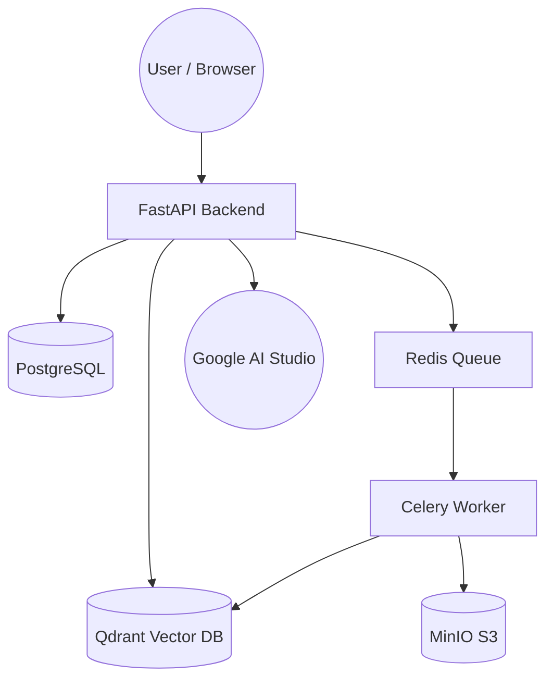

<div align="center">

# Handelny 🤖📄
**Create AI Customer Support Agents From Your Documents in 3 Minutes**

[](https://github.com/marwantosolve/Handelny)
[](#)
[](https://opensource.org/licenses/MIT)

*An enterprise-grade, multi-tenant AI SaaS platform featuring Hybrid RAG, OpenTelemetry observability, and deep Arabic language support.*

[Live Demo](#) · [API Documentation](#) · [Architecture Docs](./docs/)

 *(Screenshot placeholder)*

</div>

---

## ⚡ Key Features

*   🌍 **Native Multilingual RAG:** Full support for Arabic (RTL, morphological alignment) and English processing.
*   🧠 **3 Agent Response Modes:** Choose between strict Knowledge Base grounding (NLI hallucination guardrails), AI-assisted, or automated Web Search fallbacks.
*   📊 **Built-in MLOps:** Integrated evaluation dashboards for tracking Answer Relevance and Groundedness.
*   🏢 **Enterprise Multi-Tenancy:** Secure data isolation using PostgreSQL Row-Level Security (RLS) and app-layer enforcement.
*   🔍 **Advanced Hybrid Retrieval:** Fusing Dense (embeddings) and Sparse (BM25) vector retrieval with local Cross-Encoder reranking.

---

## 🛠 Tech Stack

**Frontend:** Next.js (App Router), TypeScript, Tailwind CSS, shadcn/ui, Zustand, React Query  
**Backend:** FastAPI, Python, SQLAlchemy, Celery, Redis  
**Data & AI:** PostgreSQL (Relational), Qdrant (Vector DB), MinIO (Object Storage)  
**LLM:** Google AI Studio (`gemma-4-31b-it`)  
**Observability:** OpenTelemetry (OTEL), Prometheus, Grafana  

---

## 🏗 Architecture Overview

Handelny's architecture is designed to scale from local Docker development to a massive AWS cluster serving 100k users.



*For a deep dive into the engineering decisions, view our comprehensive [Architecture Documentation](./docs/).*

---

## 🚀 Quick Start (Local Development)

You can run the entire platform locally using Docker Compose.

**Prerequisites:**
* Docker & Docker Compose
* Node.js 20+ & pnpm
* Python 3.12+

**1. Clone the repository:**
```bash
git clone https://github.com/marwantosolve/Handelny.git
cd Handelny
```

**2. Setup environment variables:**
```bash
cp .env.example .env
# Edit .env and add your GOOGLE_AI_STUDIO_API_KEY
```

**3. Launch the stack:**
```bash
docker compose up -d
```

The platform will be available at:
* **Frontend:** `http://localhost:3000`
* **Backend API Docs:** `http://localhost:8000/docs`

---

## 📚 Documentation Directory

This project was built with rigorous engineering standards. Please refer to the `docs/` directory for detailed specifications:

*   [**RAG Architecture Rationale**](./docs/rag-pipeline.md) - Why we use hybrid chunking and cross-encoder reranking.
*   [**Database ERD & Indexing Strategy**](./docs/erd.md) - Full schema and PostgreSQL RLS design.
*   [**Security Design**](./docs/security.md) - How we prevent prompt injection and handle secret management.
*   [**Tech Stack Analysis**](./docs/tech-stack-analysis.md) - Pros, cons, and tradeoffs for all engineering decisions.
*   [**Deployment Architecture**](./docs/deployment.md) - 3-tier scaling strategy from MVP to 100k users.
*   [**API Specification**](./docs/api-spec.md) - REST API payloads and SSE streaming definitions.
*   [**Frontend Page Design**](./docs/frontend-pages.md) - React component hierarchies and state management.

---

## 🧪 Live Demo (Coming Soon)

A live demo environment is currently being provisioned. Once deployed, you can access it via:
* **URL:** [demo.handelny.com](#)
* **Login:** `guest@handelny.com`
* **Password:** `demo1234`

---

## 💡 Skills Demonstrated

This repository serves as a portfolio piece highlighting expertise in:

| Engineering Domain | Implementation in this Project |
| :--- | :--- |
| **Advanced RAG Engineering** | Qdrant Hybrid Search (Dense+Sparse) + Cross-Encoder Reranking |
| **LLM Orchestration** | Strict prompt engineering, SSE Streaming, Citation overlap guardrails |
| **Backend & System Design** | FastAPI async queues (Celery), PostgreSQL Row-Level Security, 3-tier architecture |
| **Frontend Engineering** | Next.js App Router, advanced UI state (Zustand), RTL (Arabic) layout support |
| **MLOps & Observability** | OpenTelemetry tracing, hallucination tracking, user feedback loops |

---

## 📝 License

This project is licensed under the [MIT License](LICENSE).