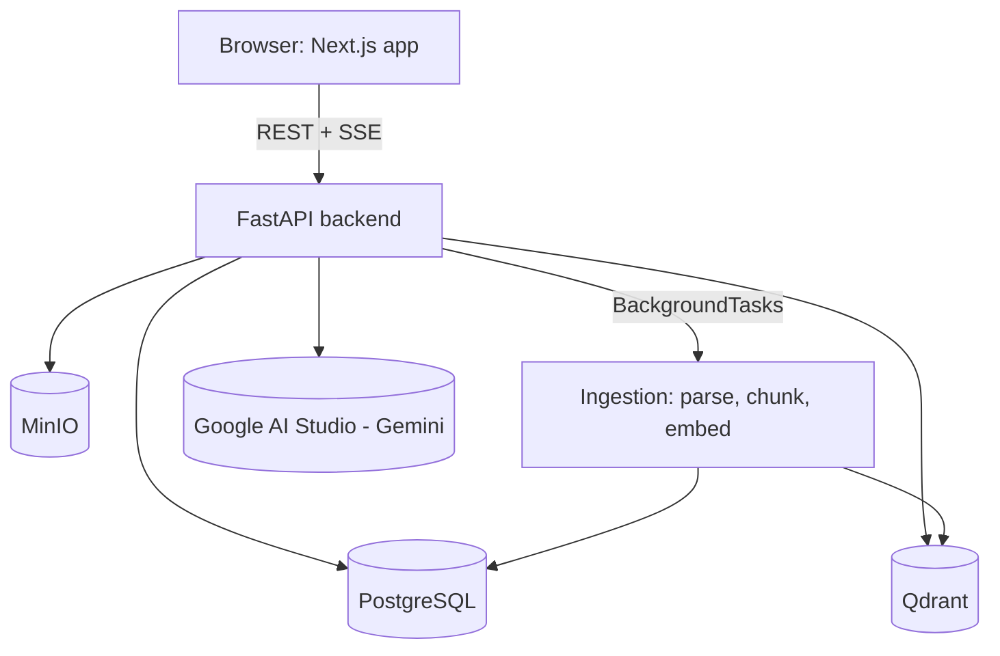

<div align="center">

# Handelny 🤖📄
**Create AI Customer Support Agents From Your Documents**

[](https://github.com/marwantosolve/Handelny/actions/workflows/ci.yml)
[](./LICENSE)

*A multi-tenant RAG platform: upload your company's documents, and get an AI support agent that
answers questions grounded in them — with citations, not guesses.*

[Architecture Docs](./docs/) · [v1 Implementation Plan](./docs/v1.md) · [Roadmap](./docs/phases/)

</div>

---

## ⚡ What v1 does

This is the **v1 milestone**: a working, self-hostable RAG pipeline end-to-end, not the full
long-term vision (see [Roadmap](#-roadmap) below for what's next).

* 🔐 **Register/login** — JWT auth, one organization created per account.
* 🤖 **One agent per org** — configurable system prompt, welcome/fallback messages, language.
* 📄 **Document ingestion** — upload PDF/TXT/MD, background pipeline parses → chunks → embeds
  → indexes into Qdrant (multilingual `intfloat/multilingual-e5-large` embeddings, so it works for
  Arabic and English content).
* 💬 **Grounded chat with citations** — ask a question in the Playground, get a streamed answer
  (SSE) generated only from retrieved document chunks, with sources shown. If nothing relevant is
  found, the agent returns its configured fallback message instead of guessing.
* 🏢 **Multi-tenant data model** — every row is scoped to an organization at the query layer.

**Deliberately out of scope for v1** (see [`docs/v1.md`](./docs/v1.md) for the full rationale):
hybrid/BM25 + reranked retrieval, multiple agent modes (KB+AI / KB+Web), the embeddable widget,
Celery-based async workers, RBAC beyond a single role, analytics/evaluation dashboards, and cloud
deployment. These are documented in [`docs/phases/`](./docs/phases/) as the v2+ roadmap.

---

## 🛠 Tech Stack

**Frontend:** Next.js 14 (App Router), TypeScript, Tailwind CSS — no extra state/UI libraries for v1
**Backend:** FastAPI, SQLAlchemy 2.0 (async), Alembic, FastAPI `BackgroundTasks` for ingestion
**Data & AI:** PostgreSQL, Qdrant (vector DB), MinIO (S3-compatible object storage)
**Embeddings:** `intfloat/multilingual-e5-large` via `sentence-transformers` (local, free, multilingual)
**LLM:** Google AI Studio — Gemini API (`google-genai` SDK)
**Infra:** Docker Compose (local dev), GitHub Actions CI

---

## 🏗 Architecture



Flow: **Register → Create Agent → Upload document(s) → background ingestion (parse → clean →
chunk → embed → upsert to Qdrant) → ask a question in the Playground → retrieve top-k chunks →
build a grounded prompt → stream a cited answer.**

See [`docs/rag-pipeline.md`](./docs/rag-pipeline.md) for the full RAG design rationale and
[`docs/erd.md`](./docs/erd.md) for the long-term database design (v1 uses a trimmed subset — see
[`docs/v1.md`](./docs/v1.md)).

---

## 🚀 Quick Start (Local Development)

**Prerequisites:** Docker & Docker Compose, Node.js 20+ & pnpm, Python 3.12+ (only needed if you
want to run the backend outside Docker).

**1. Clone and configure:**
```bash
git clone https://github.com/marwantosolve/Handelny.git
cd Handelny
cp .env.example .env
# Edit .env and set GOOGLE_AI_STUDIO_API_KEY (get a free key at https://aistudio.google.com/apikey)
# and JWT_SECRET (any long random string).
```

**2. Launch everything:**
```bash
docker compose -f docker/docker-compose.yml up -d --build
```
This starts Postgres, Redis, Qdrant, MinIO, the FastAPI backend (`:8000`), and the Next.js frontend
(`:3000`). First boot will take a few minutes — the backend image installs `sentence-transformers`
and its dependencies, and the embedding model itself downloads on first use.

**3. Run database migrations** (first time only, or after pulling new migrations):
```bash
docker compose -f docker/docker-compose.yml exec backend uv run alembic upgrade head
```

**4. Open the app:**
* **Frontend:** http://localhost:3000 — register an account, create an agent, upload a document,
  chat with it in the Playground.
* **Backend API docs:** http://localhost:8000/docs
* **Health check:** http://localhost:8000/api/v1/health (reports Postgres + Qdrant connectivity)
* **MinIO console:** http://localhost:9001 (`minioadmin` / `minioadmin`)
* **Qdrant dashboard:** http://localhost:6333/dashboard

### Running without Docker

Backend (needs Postgres/Qdrant/MinIO reachable, e.g. from `docker compose up postgres qdrant minio`):
```bash
cd apps/api
pip install uv && uv sync
uv run alembic upgrade head
uv run uvicorn app.main:app --reload
```

Frontend:
```bash
cd apps/web
pnpm install
cp .env.local.example .env.local  # set NEXT_PUBLIC_API_URL if not localhost:8000
pnpm dev
```

---

## 🧪 Testing

```bash
# Backend (needs Postgres + MinIO + Qdrant reachable — via docker compose or locally)
cd apps/api
uv run ruff check .
uv run pytest -v

# Frontend
cd apps/web
pnpm lint
pnpm type-check
pnpm build
```
CI (`.github/workflows/ci.yml`) runs both of the above against real Postgres/MinIO/Qdrant service
containers on every push/PR.

---

## 📚 Documentation

*   [**v1 Implementation Plan**](./docs/v1.md) — what v1 is, why things were trimmed, and what's next.
*   [**Roadmap (Phases 0-6)**](./docs/phases/) — the full long-term architecture plan.
*   [**RAG Architecture Rationale**](./docs/rag-pipeline.md)
*   [**Database ERD**](./docs/erd.md)
*   [**Security Design**](./docs/security.md)
*   [**Tech Stack Analysis**](./docs/tech-stack-analysis.md)
*   [**Deployment Architecture**](./docs/deployment.md)
*   [**API Specification**](./docs/api-spec.md)

---

## 🗺 Roadmap

v1 proves the core loop end-to-end. Planned next (see [`docs/phases/`](./docs/phases/) for detail):
hybrid (dense + BM25) retrieval with cross-encoder reranking, the embeddable chat widget, KB+AI /
KB+Web agent modes, RBAC, Postgres Row-Level Security, analytics + evaluation dashboards,
Celery-based ingestion workers, OpenTelemetry observability, and a cloud deployment target.

---

## 📝 License

This project is licensed under the [MIT License](LICENSE).
