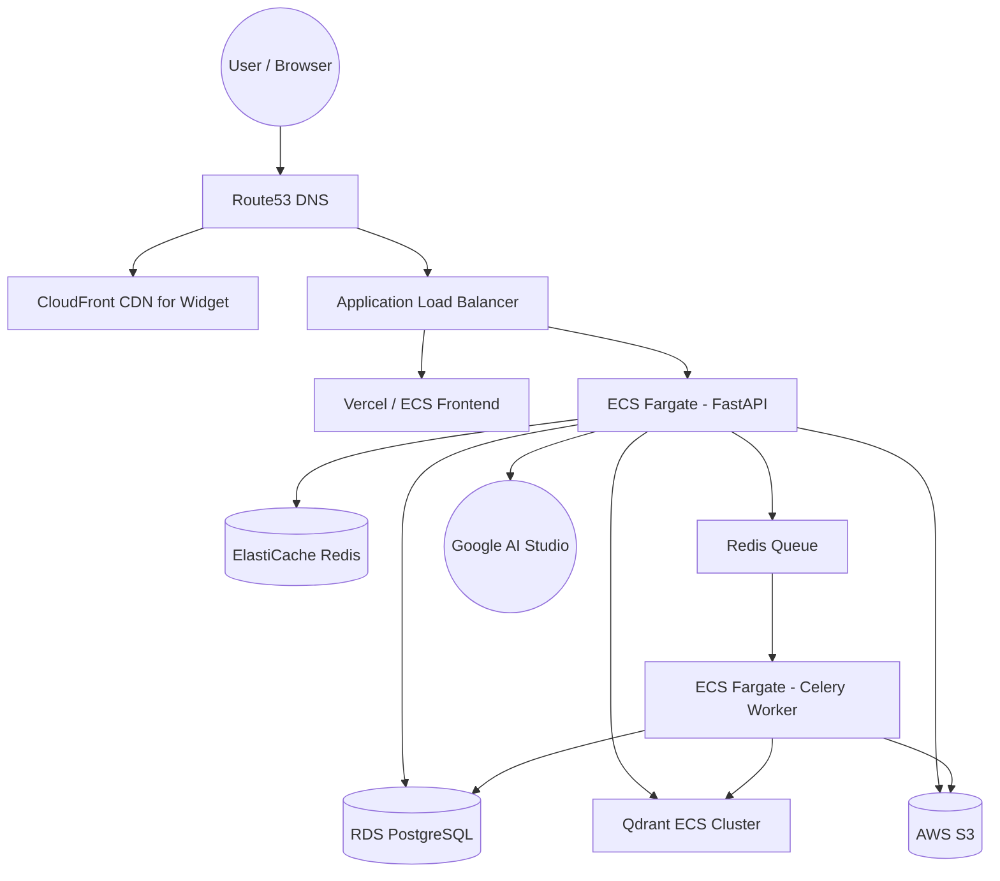

# Deployment & Scaling Architecture

## 1. Local Development Setup

*   **Topology:** Handled entirely by Docker Compose.
*   **Services:** `frontend` (Next.js, port 3000), `backend` (FastAPI, port 8000), `celery_worker`, `postgres`, `redis`, `qdrant`, `minio`.
*   **Hot-Reload:** Backend uses `uvicorn --reload`; Frontend uses `next dev`. Code directories are mounted as volumes.

## 2. Production Architecture (AWS)

## 3. Three-Tier Scaling Strategy

### Tier 1: 10 Users (MVP / Demo)
*   **Compute:** Single VPS (e.g., DigitalOcean or AWS EC2 t3.medium) running Docker Compose.
*   **Storage:** Local disk mounts for Postgres and Qdrant. MinIO for files.
*   **Queue:** 1 Celery worker.
*   **Cost:** ~$20 - $40 / month.
*   **Rationale:** Proves the concept with zero DevOps overhead.

### Tier 2: 1,000 Users (Growth Phase)
*   **Compute:** Managed Services. AWS ECS (Fargate) for APIs, auto-scaling from 2 to 10 instances.
*   **Database:** AWS RDS PostgreSQL (db.t3.large) + PgBouncer for connection pooling to handle FastAPI's async connections.
*   **Vector DB:** Managed Qdrant Cloud or dedicated EC2 instance.
*   **Queue:** 5-10 Celery workers scaling based on Redis queue depth.
*   **Cost:** ~$300 - $600 / month.
*   **Rationale:** Separates stateful components (DB) from stateless (API) allowing APIs to scale horizontally during traffic spikes.

### Tier 3: 100,000 Users (Enterprise Scale)
*   **Compute:** Large EKS/ECS clusters.
*   **Database:** RDS Aurora PostgreSQL with Read Replicas (routing GET requests to replicas).
*   **Vector DB:** Qdrant cluster sharded across multiple nodes to handle millions of vectors in memory.
*   **Caching:** Redis Cluster + Semantic Caching (intercepting identical queries before they hit the LLM).
*   **Queue:** Multiple queues (Ingestion Queue, Evaluation Queue, High-Priority Webhook Queue).
*   **Cost:** $5,000+ / month (largely driven by API usage and vector RAM).
*   **Rationale:** Eliminates single points of failure. Semantic caching drastically reduces LLM API costs.

## 4. CI/CD Pipeline

*   **Platform:** GitHub Actions.
*   **Flow:**
    1.  Push to `main`.
    2.  Linting (Ruff/ESLint) & Tests (Pytest/Vitest) run.
    3.  If tests pass, Docker images are built and pushed to AWS ECR.
    4.  Terraform/AWS CLI triggers ECS rolling update.
    5.  Alembic migrations run automatically before new API containers accept traffic.