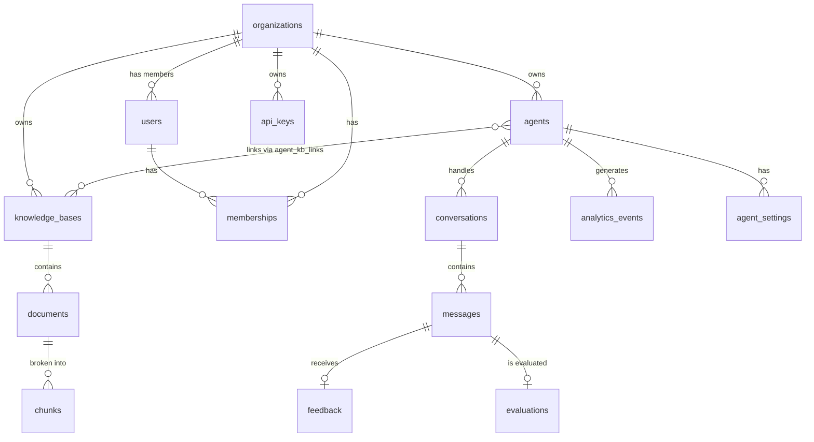

# Database ERD & Indexing Strategy

## 1. Entity-Relationship Diagram



## 2. Complete Schema Definitions & Relationships

### `organizations`
- `id`: UUID (PK)
- `name`: VARCHAR(255)
- `slug`: VARCHAR(255) (UNIQUE)
- `plan`: VARCHAR(50)
- `settings`: JSONB
- `created_at`: TIMESTAMP
- `updated_at`: TIMESTAMP

### `users`
- `id`: UUID (PK)
- `email`: VARCHAR(255) (UNIQUE)
- `password_hash`: VARCHAR(255)
- `full_name`: VARCHAR(255)
- `avatar_url`: VARCHAR(255)
- `locale`: VARCHAR(10)
- `is_active`: BOOLEAN
- `created_at`: TIMESTAMP
- `updated_at`: TIMESTAMP

### `memberships`
- `id`: UUID (PK)
- `user_id`: UUID (FK -> users.id)
- `org_id`: UUID (FK -> organizations.id)
- `role`: ENUM ('owner', 'admin', 'member', 'viewer')
- `created_at`: TIMESTAMP

### `agents`
- `id`: UUID (PK)
- `org_id`: UUID (FK -> organizations.id)
- `name`: VARCHAR(255)
- `description`: TEXT
- `mode`: ENUM ('1', '2', '3')
- `system_prompt`: TEXT
- `language`: ENUM ('ar', 'en', 'auto')
- `welcome_message`: TEXT
- `fallback_message`: TEXT
- `temperature`: FLOAT
- `max_tokens`: INTEGER
- `version`: INTEGER
- `is_active`: BOOLEAN
- `widget_config`: JSONB
- `created_at`: TIMESTAMP
- `updated_at`: TIMESTAMP

### `knowledge_bases`
- `id`: UUID (PK)
- `org_id`: UUID (FK -> organizations.id)
- `name`: VARCHAR(255)
- `description`: TEXT
- `embedding_model`: VARCHAR(255)
- `chunk_size`: INTEGER
- `chunk_overlap`: INTEGER
- `status`: VARCHAR(50)
- `doc_count`: INTEGER
- `chunk_count`: INTEGER
- `version`: INTEGER
- `created_at`: TIMESTAMP
- `updated_at`: TIMESTAMP

### `agent_kb_links`
- `id`: UUID (PK)
- `agent_id`: UUID (FK -> agents.id)
- `kb_id`: UUID (FK -> knowledge_bases.id)
- `created_at`: TIMESTAMP

### `documents`
- `id`: UUID (PK)
- `kb_id`: UUID (FK -> knowledge_bases.id)
- `org_id`: UUID (FK -> organizations.id)
- `filename`: VARCHAR(255)
- `file_type`: VARCHAR(50)
- `file_size`: INTEGER
- `storage_path`: VARCHAR(500)
- `status`: ENUM ('pending', 'processing', 'ready', 'error')
- `language`: VARCHAR(10)
- `page_count`: INTEGER
- `chunk_count`: INTEGER
- `error_message`: TEXT
- `created_at`: TIMESTAMP
- `updated_at`: TIMESTAMP

### `chunks`
- `id`: UUID (PK)
- `document_id`: UUID (FK -> documents.id)
- `kb_id`: UUID (FK -> knowledge_bases.id)
- `org_id`: UUID (FK -> organizations.id)
- `content`: TEXT
- `token_count`: INTEGER
- `chunk_index`: INTEGER
- `page_numbers`: ARRAY
- `heading_hierarchy`: JSONB
- `metadata`: JSONB
- `embedding_id`: UUID (Refers to Qdrant ID)
- `created_at`: TIMESTAMP

### `conversations`
- `id`: UUID (PK)
- `agent_id`: UUID (FK -> agents.id)
- `org_id`: UUID (FK -> organizations.id)
- `session_id`: VARCHAR(255)
- `visitor_id`: VARCHAR(255)
- `channel`: VARCHAR(50)
- `language`: VARCHAR(10)
- `status`: VARCHAR(50)
- `message_count`: INTEGER
- `created_at`: TIMESTAMP
- `updated_at`: TIMESTAMP

### `messages`
- `id`: UUID (PK)
- `conversation_id`: UUID (FK -> conversations.id)
- `org_id`: UUID (FK -> organizations.id)
- `role`: ENUM ('user', 'assistant', 'system')
- `content`: TEXT
- `sources`: JSONB
- `confidence_score`: FLOAT
- `token_count`: INTEGER
- `latency_ms`: INTEGER
- `mode_used`: VARCHAR(10)
- `created_at`: TIMESTAMP

### `feedback`
- `id`: UUID (PK)
- `message_id`: UUID (FK -> messages.id)
- `org_id`: UUID (FK -> organizations.id)
- `rating`: ENUM ('thumbs_up', 'thumbs_down')
- `comment`: TEXT
- `created_at`: TIMESTAMP

### `evaluations`
- `id`: UUID (PK)
- `message_id`: UUID (FK -> messages.id)
- `org_id`: UUID (FK -> organizations.id)
- `answer_relevance`: FLOAT
- `groundedness`: FLOAT
- `hallucination_flag`: BOOLEAN
- `evaluated_by`: VARCHAR(255)
- `created_at`: TIMESTAMP

### `analytics_events`
- `id`: UUID (PK)
- `org_id`: UUID (FK -> organizations.id)
- `agent_id`: UUID (FK -> agents.id)
- `event_type`: VARCHAR(255)
- `metadata`: JSONB
- `created_at`: TIMESTAMP

### `agent_settings`
- `id`: UUID (PK)
- `agent_id`: UUID (FK -> agents.id)
- `org_id`: UUID (FK -> organizations.id)
- `key`: VARCHAR(255)
- `value`: JSONB
- `created_at`: TIMESTAMP
- `updated_at`: TIMESTAMP

### `api_keys`
- `id`: UUID (PK)
- `org_id`: UUID (FK -> organizations.id)
- `name`: VARCHAR(255)
- `key_hash`: VARCHAR(255)
- `prefix`: VARCHAR(10)
- `scopes`: JSONB
- `last_used_at`: TIMESTAMP
- `expires_at`: TIMESTAMP
- `created_at`: TIMESTAMP

## 3. Indexing Strategy

To ensure high performance at scale, we apply the following indexes:

### Primary Indexes
* Auto-generated B-Tree indexes on all `id` (UUID) primary keys.

### Foreign Key Indexes
* Every FK column (e.g., `org_id`, `kb_id`, `agent_id`, `document_id`) gets a standard B-Tree index. This is critical for JOIN performance and cascade deletes.

### Composite Indexes
* `idx_org_agent`: `(org_id, agent_id)` on `agents` table. Frequently queried together in middleware.
* `idx_conversation_created`: `(agent_id, created_at DESC)` on `conversations` to quickly load recent chats for a specific agent.
* `idx_messages_conversation`: `(conversation_id, created_at ASC)` on `messages` to sequentially load chat history.

### Partial Indexes
* `idx_active_agents`: `(org_id)` WHERE `is_active = true`. Optimizes filtering out deleted/disabled agents.
* `idx_pending_docs`: `(org_id)` WHERE `status = 'pending' OR status = 'processing'`. Fast polling for the frontend dashboard document upload screen.

### Unique Constraints
* `users.email`
* `organizations.slug`
* `(user_id, org_id)` on `memberships` table (a user can only have one membership record per org).
* `(agent_id, kb_id)` on `agent_kb_links` table.

## 4. Multi-Tenant Considerations

* **`org_id` on Everything:** Every table (except users) has an `org_id` column. Even `chunks` and `messages` have it. This avoids complex JOINs just to verify ownership.
* **Row-Level Security (RLS):** 
  ```sql
  ALTER TABLE agents ENABLE ROW LEVEL SECURITY;
  CREATE POLICY tenant_isolation ON agents 
  FOR ALL USING (org_id = current_setting('app.current_org_id')::uuid);
  ```
* This ensures that even if an API route forgets a `.where(org_id=...)` clause, Postgres will reject queries belonging to another tenant.