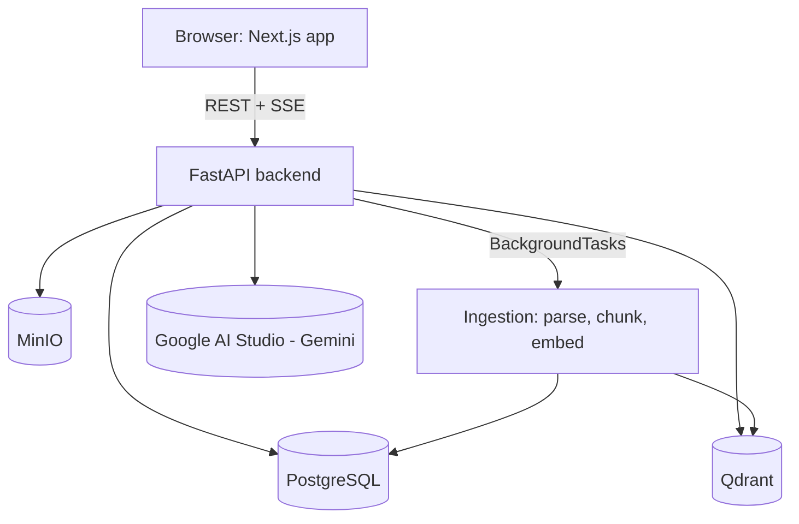

# Handelny v1 — Implementation Plan

**Goal:** Get Handelny from "empty scaffold + extensive docs" to a **running, public, demoable v1**
as fast as possible: a user can register, create an agent, upload a document, and chat with it and
get a grounded answer. Everything else (multi-tenant hardening, hybrid retrieval, reranking, 3 agent
modes, widget, evaluation dashboards, AWS deployment, OpenTelemetry, etc.) is explicitly deferred to
v2+ and tracked in `docs/phases/`, which remains the long-term roadmap.

This doc is the single source of truth for "what does v1 mean" and "what order do we build it in."
Check off tasks as they land. Each checked-off group should correspond to one atomic commit.

---

## 0. Current State (audit, 2026-08-29)

- **Backend (`apps/api`):** only `main.py` with a health check endpoint + `pyproject.toml` with the
  full dependency list from the docs. No DB models, no migrations, no auth, no RAG, no tests.
- **Frontend:** `apps/web` **does not exist**. There's a stray `create-next-app` default scaffold
  sitting at `docs/apps/web/` (wrong location — looks like it was generated into the wrong folder by
  a previous session). It has no real pages, just the Next.js starter template.
- **`packages/shared`:** a few TypeScript interfaces, no build config used anywhere yet.
- **`packages/widget`:** `package.json` only, no source.
- **Infra:** `docker/docker-compose.yml` has postgres (pgvector image, unused extension for v1),
  redis, qdrant, minio — no backend/frontend service, no Dockerfiles.
- **CI:** `.github/workflows/` is empty. No `LICENSE` file despite the README linking to one.
- **Docs:** Extremely thorough (`docs/phases/PHASE-0..6`, ERD, API spec, RAG rationale, tech stack
  analysis, deployment, security, portfolio strategy) — this is the full v2+ vision, not v1.
- **Tooling available to the agent doing this work:** Python 3 and Git (via WSL) are available.
  **Node, pnpm, and Docker are not installed/on PATH** in this environment. This means frontend code
  and Docker Compose cannot be built/run/validated by the agent — they can only be hand-written
  correctly and validated by the human running `pnpm install` / `docker compose up` locally. Backend
  Python code can be sanity-checked (syntax, unit tests with mocked externals) without Docker.

---

## 1. v1 Scope Decisions

Trimmed from the full 6-phase plan. Rationale for each trim is included so it's clear this is a
deliberate simplification, not an oversight — every trimmed item has a home in `docs/phases/` for v2.

| Area | Full plan (v2+) | v1 decision | Why |
|---|---|---|---|
| Auth | JWT + refresh tokens, RBAC (owner/admin/member/viewer), password reset | JWT access token only, single role, register auto-creates one org | Enough to prove multi-user/tenant-scoped data without building a full IAM system first |
| Multi-tenancy | Postgres RLS + app-layer filtering | App-layer `org_id` filtering only (RLS documented as a v2 TODO) | RLS is a hardening layer, not required for basic correctness |
| File storage | MinIO (S3-compatible) | Keep MinIO — it's already in docker-compose and trivial via `boto3`/`aioboto3` | No real trim needed, low cost to keep |
| Ingestion pipeline | Celery + Redis async workers | FastAPI `BackgroundTasks` (in-process) | Removes a whole worker process/deployment concern for v1; same interface so swapping to Celery later is a small diff |
| Document types | PDF, DOCX, TXT, MD | PDF, TXT, MD (skip DOCX) | Cuts one parser dependency; DOCX is a 1-day add later |
| Chunking | Hybrid semantic + size-based, Arabic-aware sentence splitting | Simple size-based chunking (token count + overlap) via `tiktoken` | Semantic/heading-aware chunking is a quality upgrade, not required for "it works" |
| Embeddings | `intfloat/multilingual-e5-large` (1024-dim) | Same model | It's free, local, and multilingual — no reason to trim this, it's central to the "Arabic support" story |
| Vector DB | Qdrant, dense + sparse per-org collections | Qdrant, dense only, one collection per org (payload-filtered by `kb_id`) | Sparse/BM25 + RRF fusion is a retrieval-quality upgrade for v2 |
| Reranking | Local cross-encoder (`bge-reranker-v2-m3`) | Skipped for v1 | Extra model download + latency; top-k dense retrieval is enough to prove the RAG loop works |
| LLM | Google AI Studio (Gemini/Gemma) | Same — **needs an API key from you (see Open Questions)** | Already the documented choice, free tier available |
| Agent modes | 3 modes (KB-only, KB+AI, KB+Web) | Mode 1 (KB-only, strict grounding) only | This is the core RAG value prop; modes 2/3 are variations on prompting + a web search API integration |
| Guardrails | Citation coverage/overlap check | Simple "answer must cite at least one retrieved chunk or return the fallback message" prompt + check | Lightweight version of the same idea |
| Chat transport | SSE streaming | SSE streaming (kept — it's not extra work with FastAPI `StreamingResponse` and matters for perceived latency) | No trim |
| Widget | Preact embeddable `<script>` widget | Skipped for v1 | Chat happens in the dashboard "Playground" page instead; the widget is a packaging exercise on top of the same chat API |
| Frontend | Full Next.js dashboard (landing, wizard, analytics, evaluation dashboard, i18n, RTL, dark mode) | Landing/marketing page kept minimal; Register/Login; single Agent view; Document upload+status; Chat Playground | Everything else is UI polish on top of APIs that don't exist yet in v1 |
| Analytics/Evaluation | Full analytics + eval dashboards, feedback loop | Skipped for v1 (thumbs up/down endpoint may be added if time allows, no dashboard) | Needs usage data to be meaningful anyway |
| Observability | OpenTelemetry, Prometheus, Grafana | Skipped for v1 (structured logging only) | Not needed to prove functionality |
| Deployment | AWS (ECS/RDS), 3-tier scaling | Docker Compose only for v1 (`docker compose up` runs everything) | Cloud deployment is a separate milestone — see Open Questions on whether you want a live URL for v1 too |
| CI | Full lint/type-check/test pipeline, staging/prod CD | One GitHub Actions workflow: backend lint (ruff) + test (pytest), frontend lint + build | Enough to keep the public repo green; CD pipelines come later |

**Not trimmed / kept as-is because they're cheap and part of the core pitch:** multilingual
(Arabic + English) embeddings and LLM responses, SSE streaming, org-scoped multi-tenant data model,
citations in chat responses.

---

## 2. Target v1 Architecture

Flow: **Register → Login → Create Agent → Upload Document(s) to a Knowledge Base → background
ingestion (parse → clean → chunk → embed → upsert Qdrant) → Chat Playground asks a question →
retrieve top-k chunks from Qdrant → build grounded prompt → stream Gemini response with citations.**

---

## 3. Workstreams & Tasks

Each workstream below is written to be executable with a disjoint file-system footprint so it can be
parallelized across sub-agents. Order matters for dependencies — **3.1 must land before 3.2/3.3/3.4
can start**, but 3.2, 3.3, and 3.4 can run in parallel once 3.1 is merged, and 3.5 (repo polish) can
run anytime.

### 3.1 — Backend Foundation (blocking for everything else in the backend)
- [ ] `app/core/config.py`: pydantic-settings (`DATABASE_URL`, `REDIS_URL`, `QDRANT_URL`, `MINIO_*`,
      `GOOGLE_AI_API_KEY`, `JWT_SECRET`, `JWT_ALGORITHM`, `CORS_ORIGINS`, upload limits)
- [ ] `app/core/db.py`: async SQLAlchemy engine + session factory, `Base` with `id/created_at/updated_at`
- [ ] `app/models/`: `User`, `Organization`, `Membership` (role: owner/member), `Agent`,
      `KnowledgeBase`, `Document`, `Chunk`, `Conversation`, `Message` (trimmed from the full ERD —
      no `feedback`, `evaluations`, `analytics_events`, `agent_settings`, `api_keys`, `agent_kb_links`
      M:M for v1; one Agent has exactly one KnowledgeBase in v1 to start simple)
- [ ] Alembic setup + initial migration
- [ ] `app/core/security.py`: password hashing (passlib/bcrypt), JWT encode/decode
- [ ] `app/api/deps.py`: `get_db`, `get_current_user`, `get_current_org`
- [ ] Global exception handlers + consistent error JSON shape
- [ ] Wire everything into `app/main.py`, keep `/api/v1/health` (extend to check DB/Qdrant connectivity)
- [ ] Basic structured logging middleware (request id, method, path, status, latency)

### 3.2 — Backend Auth + CRUD
- [ ] `app/services/auth.py` + `app/api/v1/auth.py`: `POST /register` (creates user + org +
      membership), `POST /login`, `GET /me`
- [ ] `app/services/agent.py` + `app/api/v1/agents.py`: CRUD for Agents (org-scoped)
- [ ] `app/services/knowledge_base.py` + `app/api/v1/knowledge_bases.py`: CRUD for KBs (org-scoped)
- [ ] `app/services/file_storage.py`: upload to MinIO, org-scoped paths, presigned download URLs
- [ ] `app/services/document.py` + `app/api/v1/documents.py`: upload endpoint (→ MinIO, DB row
      `status=pending`, schedules background ingestion task), list/get/delete, status polling endpoint
- [ ] Pydantic request/response schemas in `app/schemas/`
- [ ] Integration tests: register → login → create agent → create KB → upload doc → tenant isolation
      (user B cannot see user A's org data)

### 3.3 — RAG Pipeline
- [ ] `app/services/ingestion/parser.py`: PDF (pymupdf), TXT, MD → plain text + page numbers
- [ ] `app/services/ingestion/cleaner.py`: whitespace/unicode normalization, Arabic normalization
- [ ] `app/services/ingestion/language.py`: language detection (lingua)
- [ ] `app/services/ingestion/chunker.py`: token-based chunking (tiktoken), configurable size/overlap
- [ ] `app/services/embedding.py`: `multilingual-e5-large` via sentence-transformers, batched, with
      `query:`/`passage:` prefixes
- [ ] `app/services/vector_store.py`: Qdrant client wrapper — collection-per-org, upsert, search,
      payload filter by `kb_id`
- [ ] `app/services/ingestion_pipeline.py`: orchestrates parse → clean → chunk → embed → persist
      chunks in Postgres → upsert Qdrant → update document status (wired as a `BackgroundTasks` job)
- [ ] `app/services/retrieval.py`: embed query → Qdrant search (top-k) → return chunks + scores
- [ ] `app/services/llm.py`: Google AI Studio (Gemini) client wrapper, streaming generation,
      abstracted behind a small interface (so swapping providers later is cheap)
- [ ] `app/services/chat.py`: retrieve → build grounded prompt (system prompt + citations
      instructions + context + history) → stream LLM → persist `Message` rows with sources
- [ ] `app/api/v1/chat.py`: `POST /chat/{agent_id}/message` — SSE stream (`token`, `citations`, `done`)
- [ ] `app/api/v1/conversations.py`: list conversations, get message history
- [ ] Tests: ingest a small fixture PDF/TXT (EN + AR), assert chunks land in Qdrant, assert a known
      question retrieves the right chunk, assert chat endpoint returns a grounded, cited answer

### 3.4 — Frontend (`apps/web`, real Next.js app — replaces the stray scaffold in `docs/apps/web`)
- [ ] Scaffold `apps/web` properly (App Router, TypeScript, Tailwind) — hand-written since `pnpm`
      isn't available to the agent; human runs `pnpm install` to pull deps
- [ ] `lib/api-client.ts`: typed fetch wrapper against the FastAPI backend, using `@handelny/shared` types
- [ ] Minimal landing page (`/`) — hook, feature list, link to `/register`
- [ ] `/register`, `/login` pages, store JWT (httpOnly-cookie or localStorage for v1), redirect to `/dashboard`
- [ ] `/dashboard` — single agent view for v1 (create-agent-if-none-exists flow, no multi-agent list yet)
- [ ] `/dashboard/documents` — drag-drop upload, table with status polling (`refetchInterval`)
- [ ] `/dashboard/playground` — chat UI consuming the SSE endpoint, shows streamed tokens + citations
- [ ] Update `packages/shared/src/types` if backend schemas diverge from the current guesses

### 3.5 — Repo/Infra Polish (parallelizable, no backend/frontend code dependency)
- [ ] Add `LICENSE` (MIT, referenced by README but missing)
- [ ] Delete the stray `docs/apps/web` create-next-app leftover (superseded by real `apps/web`)
- [ ] `docker/backend.Dockerfile`, `docker/frontend.Dockerfile`; add `backend`/`frontend` services to
      `docker/docker-compose.yml`
- [ ] `.env.example` review/update to match `app/core/config.py` settings
- [ ] `.github/workflows/ci.yml`: backend (ruff + pytest), frontend (eslint + build)
- [ ] Update root `README.md`: accurate quick start, accurate feature list (remove/flag claims not
      true for v1 — badges currently claim 90% coverage and passing CI which don't exist yet),
      "Roadmap" section pointing to `docs/phases/` for v2+
- [ ] `scripts/setup-dev.sh` review — make sure it matches actual v1 setup steps

---

## 4. Milestones (suggested order)

1. **M1 — Backend boots for real:** 3.1 done, `docker compose up` (postgres/redis/qdrant/minio) +
   `uvicorn` locally, `/api/v1/health` reports DB+Qdrant connectivity OK, migrations run cleanly.
2. **M2 — API-only product works:** 3.2 + 3.3 done. Provable via `curl`/pytest: register, login,
   create agent, create KB, upload a doc, poll until `ready`, chat and get a cited answer streamed.
3. **M3 — It has a face:** 3.4 done. Same flow, but clickable in the browser.
4. **M4 — It's a public repo:** 3.5 done. `git clone` → follow README → works. CI green.

v1 is "done" at M4. Everything in `docs/phases/` beyond what's listed above is v2+.

---

## 5. Open Questions (need your input before/while implementing)

1. **LLM API key:** Do you already have a Google AI Studio (Gemini) API key you'll drop into `.env`,
   or should the LLM client be provider-agnostic enough to swap to OpenAI/Anthropic if that's easier
   for you to get a key for right now? (Code will be written behind an interface either way — this
   only affects which SDK v1 wires up by default.)
2. **Public live demo vs. "clone and run":** Does "ready to run" for v1 mean *only* `docker compose up`
   locally, or do you also want a hosted public URL (e.g., Render/Railway free tier for the API,
   Vercel for the frontend) as part of v1? This changes whether deployment configs are in scope now
   or deferred to v2.
3. **Stray scaffold cleanup:** OK to delete `docs/apps/web` (the misplaced `create-next-app` output)
   once the real `apps/web` exists?
4. **Tooling in this environment:** I don't have Node/pnpm/Docker available in my sandbox (only
   Python and Git via WSL), so I can't run `pnpm install`, `docker compose up`, or a frontend build
   myself to validate — I'll write the code carefully and you'll be the one running it end-to-end.
   I *can* write and run backend Python unit tests with mocked externals. Let me know if you'd
   rather I attempt to get Node/Docker working in the WSL distro first (slower, but would let me
   self-validate the frontend and full docker-compose stack).

---

## 6. Commit Strategy

Small, atomic commits, one logical change per commit, in roughly this order:
`chore(repo)` cleanup → `feat(api-core)` foundation → `feat(api-auth)` → `feat(api-rag)` →
`feat(web)` pages one at a time → `chore(infra)` docker/CI → `docs` README update.
No pushes — commits are made locally so you can review and push to `main` yourself.
