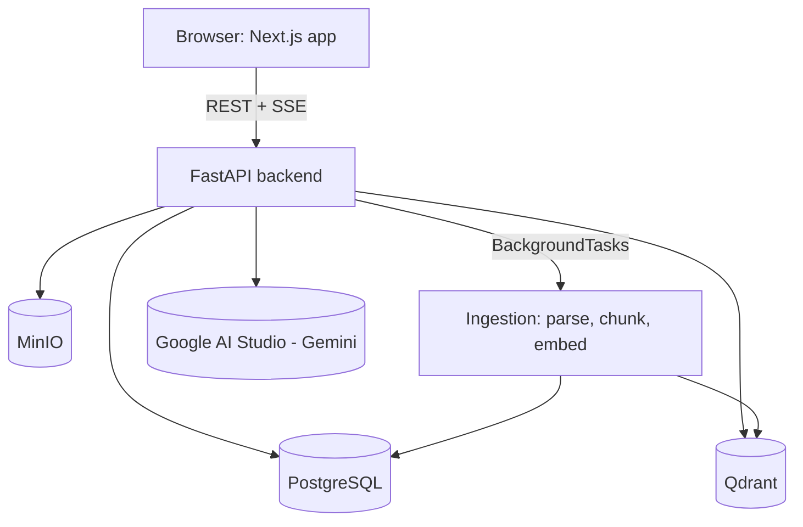

# Handelny v1 — Implementation Plan

**Goal:** Get Handelny from "empty scaffold + extensive docs" to a **running, public, demoable v1**
as fast as possible: a user can register, create an agent, upload a document, and chat with it and
get a grounded answer. Everything else (multi-tenant hardening, hybrid retrieval, reranking, 3 agent
modes, widget, evaluation dashboards, AWS deployment, OpenTelemetry, etc.) is explicitly deferred to
v2+ and tracked in `docs/phases/`, which remains the long-term roadmap.

This doc is the single source of truth for "what does v1 mean" and "what order do we build it in."
Check off tasks as they land. Each checked-off group should correspond to one atomic commit.

---

## 0. Current State (audit, 2026-08-29)

- **Backend (`apps/api`):** only `main.py` with a health check endpoint + `pyproject.toml` with the
  full dependency list from the docs. No DB models, no migrations, no auth, no RAG, no tests.
- **Frontend:** `apps/web` **does not exist**. There's a stray `create-next-app` default scaffold
  sitting at `docs/apps/web/` (wrong location — looks like it was generated into the wrong folder by
  a previous session). It has no real pages, just the Next.js starter template.
- **`packages/shared`:** a few TypeScript interfaces, no build config used anywhere yet.
- **`packages/widget`:** `package.json` only, no source.
- **Infra:** `docker/docker-compose.yml` has postgres (pgvector image, unused extension for v1),
  redis, qdrant, minio — no backend/frontend service, no Dockerfiles.
- **CI:** `.github/workflows/` is empty. No `LICENSE` file despite the README linking to one.
- **Docs:** Extremely thorough (`docs/phases/PHASE-0..6`, ERD, API spec, RAG rationale, tech stack
  analysis, deployment, security, portfolio strategy) — this is the full v2+ vision, not v1.
- **Tooling available to the agent doing this work:** Python 3 and Git (via WSL) are available.
  **Node, pnpm, and Docker are not installed/on PATH** in this environment. This means frontend code
  and Docker Compose cannot be built/run/validated by the agent — they can only be hand-written
  correctly and validated by the human running `pnpm install` / `docker compose up` locally. Backend
  Python code can be sanity-checked (syntax, unit tests with mocked externals) without Docker.

---

## 1. v1 Scope Decisions

Trimmed from the full 6-phase plan. Rationale for each trim is included so it's clear this is a
deliberate simplification, not an oversight — every trimmed item has a home in `docs/phases/` for v2.

| Area | Full plan (v2+) | v1 decision | Why |
|---|---|---|---|
| Auth | JWT + refresh tokens, RBAC (owner/admin/member/viewer), password reset | JWT access token only, single role, register auto-creates one org | Enough to prove multi-user/tenant-scoped data without building a full IAM system first |
| Multi-tenancy | Postgres RLS + app-layer filtering | App-layer `org_id` filtering only (RLS documented as a v2 TODO) | RLS is a hardening layer, not required for basic correctness |
| File storage | MinIO (S3-compatible) | Keep MinIO — it's already in docker-compose and trivial via `boto3`/`aioboto3` | No real trim needed, low cost to keep |
| Ingestion pipeline | Celery + Redis async workers | FastAPI `BackgroundTasks` (in-process) | Removes a whole worker process/deployment concern for v1; same interface so swapping to Celery later is a small diff |
| Document types | PDF, DOCX, TXT, MD | PDF, TXT, MD (skip DOCX) | Cuts one parser dependency; DOCX is a 1-day add later |
| Chunking | Hybrid semantic + size-based, Arabic-aware sentence splitting | Simple size-based chunking (token count + overlap) via `tiktoken` | Semantic/heading-aware chunking is a quality upgrade, not required for "it works" |
| Embeddings | `intfloat/multilingual-e5-large` (1024-dim) | Same model | It's free, local, and multilingual — no reason to trim this, it's central to the "Arabic support" story |
| Vector DB | Qdrant, dense + sparse per-org collections | Qdrant, dense only, one collection per org (payload-filtered by `kb_id`) | Sparse/BM25 + RRF fusion is a retrieval-quality upgrade for v2 |
| Reranking | Local cross-encoder (`bge-reranker-v2-m3`) | Skipped for v1 | Extra model download + latency; top-k dense retrieval is enough to prove the RAG loop works |
| LLM | Google AI Studio (Gemini/Gemma) | Same — **needs an API key from you (see Open Questions)** | Already the documented choice, free tier available |
| Agent modes | 3 modes (KB-only, KB+AI, KB+Web) | Mode 1 (KB-only, strict grounding) only | This is the core RAG value prop; modes 2/3 are variations on prompting + a web search API integration |
| Guardrails | Citation coverage/overlap check | Simple "answer must cite at least one retrieved chunk or return the fallback message" prompt + check | Lightweight version of the same idea |
| Chat transport | SSE streaming | SSE streaming (kept — it's not extra work with FastAPI `StreamingResponse` and matters for perceived latency) | No trim |
| Widget | Preact embeddable `<script>` widget | Skipped for v1 | Chat happens in the dashboard "Playground" page instead; the widget is a packaging exercise on top of the same chat API |
| Frontend | Full Next.js dashboard (landing, wizard, analytics, evaluation dashboard, i18n, RTL, dark mode) | Landing/marketing page kept minimal; Register/Login; single Agent view; Document upload+status; Chat Playground | Everything else is UI polish on top of APIs that don't exist yet in v1 |
| Analytics/Evaluation | Full analytics + eval dashboards, feedback loop | Skipped for v1 (thumbs up/down endpoint may be added if time allows, no dashboard) | Needs usage data to be meaningful anyway |
| Observability | OpenTelemetry, Prometheus, Grafana | Skipped for v1 (structured logging only) | Not needed to prove functionality |
| Deployment | AWS (ECS/RDS), 3-tier scaling | Docker Compose only for v1 (`docker compose up` runs everything) | Cloud deployment is a separate milestone — see Open Questions on whether you want a live URL for v1 too |
| CI | Full lint/type-check/test pipeline, staging/prod CD | One GitHub Actions workflow: backend lint (ruff) + test (pytest), frontend lint + build | Enough to keep the public repo green; CD pipelines come later |

**Not trimmed / kept as-is because they're cheap and part of the core pitch:** multilingual
(Arabic + English) embeddings and LLM responses, SSE streaming, org-scoped multi-tenant data model,
citations in chat responses.

---

## 2. Target v1 Architecture

Flow: **Register → Login → Create Agent → Upload Document(s) to a Knowledge Base → background
ingestion (parse → clean → chunk → embed → upsert Qdrant) → Chat Playground asks a question →
retrieve top-k chunks from Qdrant → build grounded prompt → stream Gemini response with citations.**

---

## 3. Workstreams & Tasks

Each workstream below is written to be executable with a disjoint file-system footprint so it can be
parallelized across sub-agents. Order matters for dependencies — **3.1 must land before 3.2/3.3/3.4
can start**, but 3.2, 3.3, and 3.4 can run in parallel once 3.1 is merged, and 3.5 (repo polish) can
run anytime.

### 3.1 — Backend Foundation (blocking for everything else in the backend) ✅
- [x] `app/core/config.py`, `app/core/db.py`, `app/models/*` (trimmed ERD: no `feedback`,
      `evaluations`, `analytics_events`, `agent_settings`, `api_keys`, `agent_kb_links` M:M — one
      Agent has exactly one KnowledgeBase in v1)
- [x] Alembic setup + initial migration (`0001_initial_schema`)
- [x] `app/core/security.py`, `app/api/deps.py` (`get_current_principal`)
- [x] Global exception handlers, consistent error JSON shape
- [x] `app/main.py` wired up, `/api/v1/health` checks DB + Qdrant connectivity
- [x] Structured request logging middleware

### 3.2 — Backend Auth + CRUD ✅
- [x] `app/services/auth.py` + `app/api/v1/auth.py`: register (user + org + membership), login, `/me`
- [x] `app/services/agent.py` + `app/api/v1/agents.py`: CRUD for Agents (org-scoped)
- [x] `app/services/knowledge_base.py` + `app/api/v1/knowledge_bases.py`: CRUD for KBs (org-scoped)
- [x] `app/services/file_storage.py`: upload/download/delete via MinIO (aioboto3), org-scoped paths
- [x] `app/services/document.py` + `app/api/v1/documents.py`: upload → MinIO → DB row (`pending`) →
      schedules background ingestion; list/get/delete; status polling
- [x] Pydantic schemas in `app/schemas/`
- [x] Integration tests: register/login/me, agent CRUD + cross-org 404 isolation, KB/document CRUD,
      upload validation (bad extension/oversized), cascade deletes

### 3.3 — RAG Pipeline ✅
- [x] `app/services/ingestion/parser.py` (pymupdf for PDF, utf-8/latin-1 for TXT/MD)
- [x] `app/services/ingestion/cleaner.py` (NFC normalization, whitespace collapsing)
- [x] `app/services/ingestion/language.py` (lingua, EN/AR)
- [x] `app/services/ingestion/chunker.py` (tiktoken token-window chunking + overlap, page tracking)
- [x] `app/services/embedding.py` (`multilingual-e5-large`, lazy-loaded, `query:`/`passage:` prefixes)
- [x] `app/services/vector_store.py` (Qdrant, collection-per-org, dense cosine, `kb_id` payload filter)
- [x] `app/services/ingestion_pipeline.py` (parse → clean → detect → chunk → embed → upsert → persist;
      status transitions; background-task-safe error handling — never re-raises past its boundary)
- [x] `app/services/retrieval.py` (top-k dense search with a minimum relevance floor)
- [x] `app/services/llm.py` (`LLMClient` protocol + `GeminiLLMClient`, swappable provider)
- [x] `app/services/chat.py` (Mode 1 orchestration: retrieve → prompt → stream → persist → citations)
- [x] `app/api/v1/chat.py` (public SSE endpoint), `app/api/v1/conversations.py` (auth-required history)
- [x] Tests: chunker edge cases, chat endpoint contract/SSE framing

### 3.4 — Frontend ✅
- [x] `apps/web` scaffolded (Next.js 14 App Router, TypeScript, Tailwind, no extra state libs for v1)
- [x] `lib/api.ts` typed fetch wrapper, `lib/auth.ts` token storage + `useCurrentUser`
- [x] Landing page, `/register`, `/login`
- [x] `/dashboard` (create-agent-if-none flow), `/dashboard/documents` (upload + status polling),
      `/dashboard/playground` (streaming chat via `useChatStream`, citation pills)

### 3.5 — Repo/Infra Polish ✅
- [x] `LICENSE` (MIT), stray `docs/apps/web` and `docs/apps/api` scaffolds deleted
- [x] `docker/backend.Dockerfile` (uv-based), `docker/frontend.Dockerfile` (pnpm-based),
      `backend`/`frontend` services added to `docker/docker-compose.yml`
- [x] `.env.example` updated to match `app/core/config.py` settings
- [x] `.github/workflows/ci.yml`: backend (ruff + alembic + pytest against real Postgres/MinIO/Qdrant
      service containers), frontend (eslint + tsc + next build)
- [x] `README.md` rewritten to accurately describe v1 (removed unearned badges/claims), with a
      Roadmap section pointing to `docs/phases/`
- [x] Fixed a real bug caught during integration: `ingest_document` no longer re-raises after
      persisting an error — it runs as a `BackgroundTask` after the HTTP response is already sent,
      so re-raising had no useful effect and could surface as broken responses under ASGI test
      transports
- [x] Fixed a malformed `turbo.json` `outputs` array (stray `"!"` array element)

**Known follow-ups (not blocking, noted for v2):** integration tests trigger real background
ingestion (including a multilingual-e5-large model download) the first time CI runs, which is slow
but not flaky/fatal since ingestion failures are swallowed; consider mocking ingestion in tests to
speed up CI. `scripts/setup-dev.sh` still describes the pre-v1 flow (no migration step) — update it
to call `alembic upgrade head` after `docker compose up`.

---

## 4. Milestones (suggested order)

1. **M1 — Backend boots for real:** 3.1 done, `docker compose up` (postgres/redis/qdrant/minio) +
   `uvicorn` locally, `/api/v1/health` reports DB+Qdrant connectivity OK, migrations run cleanly. ✅
2. **M2 — API-only product works:** 3.2 + 3.3 done. Provable via `curl`/pytest: register, login,
   create agent, create KB, upload a doc, poll until `ready`, chat and get a cited answer streamed. ✅
3. **M3 — It has a face:** 3.4 done. Same flow, but clickable in the browser. ✅
4. **M4 — It's a public repo:** 3.5 done. `git clone` → follow README → works. CI green. ✅ (code-complete;
   CI has not run yet since nothing has been pushed to `origin` — see §7)

v1 is code-complete. Everything in `docs/phases/` beyond what's listed above is v2+.

---

## 5. Open Questions — resolved for v1

1. **LLM API key:** Left as a placeholder in `.env.example`/`.env` (`GOOGLE_AI_STUDIO_API_KEY`) —
   you'll need to add a real key from https://aistudio.google.com/apikey before chat will work.
   The `LLMClient` protocol in `app/services/llm.py` makes swapping providers later a small,
   isolated change if you'd rather use OpenAI/Anthropic. **Also corrected:** the docs referenced a
   model called `gemma-4-31b-it`, which doesn't actually exist. v1 defaults to `gemini-2.0-flash`,
   a real, current, low-cost Gemini model — change `GOOGLE_AI_MODEL` in `.env` if you prefer another.
2. **Public live demo vs. "clone and run":** Went with local-only for v1 — `docker compose up` is
   the full "ready to run" story. A hosted demo URL is real additional work (choosing a host,
   managing secrets, cold-start behavior for the embedding model) and is deferred to v2.
3. **Stray scaffold cleanup:** Deleted `docs/apps/web` and `docs/apps/api` (both were accidental
   leftovers, not real scaffolding) once the real `apps/api` and `apps/web` existed.
4. **Tooling in this environment:** Confirmed — no Node/pnpm/Docker in this sandbox, only Python
   and Git (via WSL, once `--no-pager` is used to avoid a hanging pager). All backend code was
   validated with `python -m py_compile` (60 files, 0 errors) and manual review; frontend code was
   hand-reviewed only. Neither `docker compose up` nor `pnpm install`/`next build` has been run
   against this code yet — that's the first thing to do when you pick this up locally, and CI will
   also validate the frontend build (`next build`) and backend tests against real service containers
   once this is pushed.

## 7. What's next (for you)

1. `cd Handelny`, `cp .env.example .env`, fill in `GOOGLE_AI_STUDIO_API_KEY` and a real `JWT_SECRET`.
2. `docker compose -f docker/docker-compose.yml up -d --build` — first build will be slow (backend
   image installs `sentence-transformers`/`torch`; the embedding model itself downloads on first use).
3. `docker compose -f docker/docker-compose.yml exec backend uv run alembic upgrade head`.
4. Open http://localhost:3000, register, create an agent, upload a `.txt`/`.md`/`.pdf`, wait for it
   to reach `ready` in the Documents page, then ask it a question in the Playground.
5. If anything breaks, `docker compose logs backend` / `docker compose logs frontend` are the first
   place to look — this stack has not been run end-to-end yet outside of static code review.
6. Once you're happy, push to `main` — GitHub Actions will run the full backend + frontend CI for
   the first time then.

---

## 6. Commit Strategy

Small, atomic commits, one logical change per commit, in roughly this order:
`chore(repo)` cleanup → `feat(api-core)` foundation → `feat(api-auth)` → `feat(api-rag)` →
`feat(web)` pages one at a time → `chore(infra)` docker/CI → `docs` README update.
No pushes — commits are made locally so you can review and push to `main` yourself.
